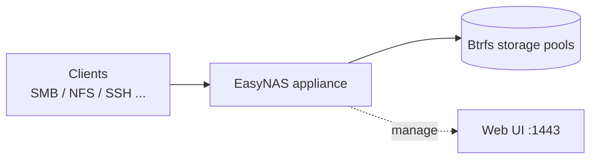

# EasyNAS

**A turnkey NAS appliance: dedicated operating system, web management, and the storage power of Btrfs.**

EasyNAS turns a spare machine — an old PC, a Raspberry Pi, an ARM NAS board, or a VM — into a
fully managed network storage server. You install one image; everything else happens in the
browser.

---

## How it works

EasyNAS is an **appliance**, not an application. The image ships a complete, purpose-built
operating system (based on openSUSE Tumbleweed) with the EasyNAS management stack on top:

- **Web UI** on `https://<your-nas>:1443` — dashboard, storage, sharing, users, updates
- **Console menu** on the attached display — password reset, network restart, restart/shutdown
- **Btrfs storage** — RAID profiles, compression, snapshots, online device management
- **Add-on system** — sharing protocols and services installed on demand from the EasyNAS repository

## Feature highlights

- **Dashboard** — CPU, memory, and per-filesystem usage at a glance; disk and SMART health
- **Filesystems & volumes** — create Btrfs pools across disks, subvolumes, snapshots
- **Sharing** — NFS, Samba, SSH out of the box; FTP, AFP, iSCSI, DLNA and more as add-ons
- **Users & groups** — manage access for all sharing protocols in one place
- **Updates** — one-click updates from the EasyNAS package repository
- **Persistent settings** — configuration lives on its own partition, separate from the OS

## Where to go next

| I want to… | Read |
|---|---|
| Check my hardware is supported | [Supported hardware](supported-hardware.md) |
| Install EasyNAS | [Installation](installation.md) |
| Set up my first share | [Getting started](getting-started.md) |
| Understand storage concepts | [Storage](storage.md) |
| Add protocols and services | [Add-ons](addons.md) |
